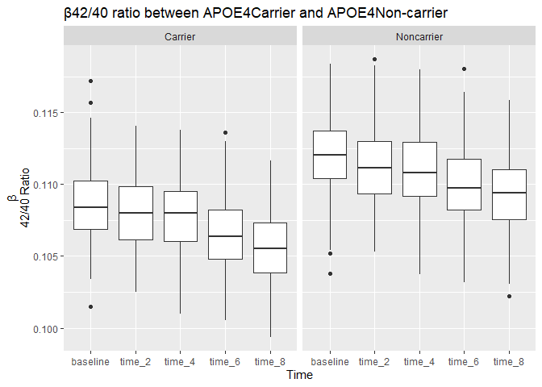

p8105_hw2_zq2227
================
Zixuan Qiu zq2227
9/28/2023

# Homework 1

## Problem 1

``` r
library(tidyverse)
```

    ## ── Attaching core tidyverse packages ──────────────────────── tidyverse 2.0.0 ──
    ## ✔ dplyr     1.1.3     ✔ readr     2.1.4
    ## ✔ forcats   1.0.0     ✔ stringr   1.5.0
    ## ✔ ggplot2   3.4.3     ✔ tibble    3.2.1
    ## ✔ lubridate 1.9.2     ✔ tidyr     1.3.0
    ## ✔ purrr     1.0.2     
    ## ── Conflicts ────────────────────────────────────────── tidyverse_conflicts() ──
    ## ✖ dplyr::filter() masks stats::filter()
    ## ✖ dplyr::lag()    masks stats::lag()
    ## ℹ Use the conflicted package (<http://conflicted.r-lib.org/>) to force all conflicts to become errors

``` r
polsmonth_data = read_csv(file = "./pols-month.csv")
```

    ## Rows: 822 Columns: 9
    ## ── Column specification ────────────────────────────────────────────────────────
    ## Delimiter: ","
    ## dbl  (8): prez_gop, gov_gop, sen_gop, rep_gop, prez_dem, gov_dem, sen_dem, r...
    ## date (1): mon
    ## 
    ## ℹ Use `spec()` to retrieve the full column specification for this data.
    ## ℹ Specify the column types or set `show_col_types = FALSE` to quiet this message.

``` r
unemployment_data = read_csv(file = "./unemployment.csv")
```

    ## Rows: 68 Columns: 13
    ## ── Column specification ────────────────────────────────────────────────────────
    ## Delimiter: ","
    ## dbl (13): Year, Jan, Feb, Mar, Apr, May, Jun, Jul, Aug, Sep, Oct, Nov, Dec
    ## 
    ## ℹ Use `spec()` to retrieve the full column specification for this data.
    ## ℹ Specify the column types or set `show_col_types = FALSE` to quiet this message.

``` r
snp_data = read_csv(file = "./snp.csv")
```

    ## Rows: 787 Columns: 2
    ## ── Column specification ────────────────────────────────────────────────────────
    ## Delimiter: ","
    ## chr (1): date
    ## dbl (1): close
    ## 
    ## ℹ Use `spec()` to retrieve the full column specification for this data.
    ## ℹ Specify the column types or set `show_col_types = FALSE` to quiet this message.

### clean the data in pols-month.csv

``` r
polsmonth_data =
  read_csv(file = "./pols-month.csv") |>
  janitor::clean_names()|>
  separate(mon, into = c("year", "month","day"), sep = "-")|>
  mutate(month = month(as.numeric(month), label = TRUE, abbr = TRUE))|>
  mutate(month=as.character(month))|>
   mutate(president = if_else(prez_gop==1, "gop", "dem"))|>
  select(-prez_gop,-prez_dem,-day)|>
  relocate(year, month, president,everything())
```

    ## Rows: 822 Columns: 9
    ## ── Column specification ────────────────────────────────────────────────────────
    ## Delimiter: ","
    ## dbl  (8): prez_gop, gov_gop, sen_gop, rep_gop, prez_dem, gov_dem, sen_dem, r...
    ## date (1): mon
    ## 
    ## ℹ Use `spec()` to retrieve the full column specification for this data.
    ## ℹ Specify the column types or set `show_col_types = FALSE` to quiet this message.

``` r
polsmonth_data
```

    ## # A tibble: 822 × 9
    ##    year  month president gov_gop sen_gop rep_gop gov_dem sen_dem rep_dem
    ##    <chr> <chr> <chr>       <dbl>   <dbl>   <dbl>   <dbl>   <dbl>   <dbl>
    ##  1 1947  Jan   dem            23      51     253      23      45     198
    ##  2 1947  Feb   dem            23      51     253      23      45     198
    ##  3 1947  Mar   dem            23      51     253      23      45     198
    ##  4 1947  Apr   dem            23      51     253      23      45     198
    ##  5 1947  May   dem            23      51     253      23      45     198
    ##  6 1947  Jun   dem            23      51     253      23      45     198
    ##  7 1947  Jul   dem            23      51     253      23      45     198
    ##  8 1947  Aug   dem            23      51     253      23      45     198
    ##  9 1947  Sep   dem            23      51     253      23      45     198
    ## 10 1947  Oct   dem            23      51     253      23      45     198
    ## # ℹ 812 more rows

### clean the data in snp.csv

``` r
snp_data = 
  read_csv(file = "./snp.csv")|>
  janitor::clean_names()|>
  mutate(date=as.Date(date, format = "%m/%d/%y"))|>
  separate(date, into = c("year", "month","day"), sep = "-")|>
  mutate(year,year=as.numeric(year))|>
  mutate(year,year=ifelse(year>2024,year-100,year+0))|>
  mutate(year,year=as.character(year))|>
  mutate(month = month(as.numeric(month), label = TRUE, abbr = TRUE))|>
  mutate(month=as.character(month))|>
  arrange(year,month)|>
  select(-day)
```

    ## Rows: 787 Columns: 2
    ## ── Column specification ────────────────────────────────────────────────────────
    ## Delimiter: ","
    ## chr (1): date
    ## dbl (1): close
    ## 
    ## ℹ Use `spec()` to retrieve the full column specification for this data.
    ## ℹ Specify the column types or set `show_col_types = FALSE` to quiet this message.

``` r
snp_data
```

    ## # A tibble: 787 × 3
    ##    year  month close
    ##    <chr> <chr> <dbl>
    ##  1 1950  Apr    18.0
    ##  2 1950  Aug    18.4
    ##  3 1950  Dec    20.4
    ##  4 1950  Feb    17.2
    ##  5 1950  Jan    17.0
    ##  6 1950  Jul    17.8
    ##  7 1950  Jun    17.7
    ##  8 1950  Mar    17.3
    ##  9 1950  May    18.8
    ## 10 1950  Nov    19.5
    ## # ℹ 777 more rows

### tidy the unemployment data

``` r
unemployment_data = 
  read_csv(file = "./unemployment.csv")|>
  janitor::clean_names()|>
  pivot_longer( 
    jan:dec,
    names_to = "month", 
    values_to = "unemploy")|>
    mutate(year=as.character(year))|>
    mutate(month=str_to_title(month))
```

    ## Rows: 68 Columns: 13
    ## ── Column specification ────────────────────────────────────────────────────────
    ## Delimiter: ","
    ## dbl (13): Year, Jan, Feb, Mar, Apr, May, Jun, Jul, Aug, Sep, Oct, Nov, Dec
    ## 
    ## ℹ Use `spec()` to retrieve the full column specification for this data.
    ## ℹ Specify the column types or set `show_col_types = FALSE` to quiet this message.

``` r
unemployment_data
```

    ## # A tibble: 816 × 3
    ##    year  month unemploy
    ##    <chr> <chr>    <dbl>
    ##  1 1948  Jan        3.4
    ##  2 1948  Feb        3.8
    ##  3 1948  Mar        4  
    ##  4 1948  Apr        3.9
    ##  5 1948  May        3.5
    ##  6 1948  Jun        3.6
    ##  7 1948  Jul        3.6
    ##  8 1948  Aug        3.9
    ##  9 1948  Sep        3.8
    ## 10 1948  Oct        3.7
    ## # ℹ 806 more rows

### mergetrashdata

``` r
firstdata = 
  inner_join(polsmonth_data, snp_data)#merge snp and pols
```

    ## Joining with `by = join_by(year, month)`

``` r
binddata=inner_join(firstdata, unemployment_data)|>
  relocate(year, month, president, close, unemploy,everything())#merge unemployment into the result.
```

    ## Joining with `by = join_by(year, month)`

``` r
binddata
```

    ## # A tibble: 786 × 11
    ##    year  month president close unemploy gov_gop sen_gop rep_gop gov_dem sen_dem
    ##    <chr> <chr> <chr>     <dbl>    <dbl>   <dbl>   <dbl>   <dbl>   <dbl>   <dbl>
    ##  1 1950  Jan   dem        17.0      6.5      18      44     177      29      57
    ##  2 1950  Feb   dem        17.2      6.4      18      44     177      29      57
    ##  3 1950  Mar   dem        17.3      6.3      18      44     177      29      57
    ##  4 1950  Apr   dem        18.0      5.8      18      44     177      29      57
    ##  5 1950  May   dem        18.8      5.5      18      44     177      29      57
    ##  6 1950  Jun   dem        17.7      5.4      18      44     177      29      57
    ##  7 1950  Jul   dem        17.8      5        18      44     177      29      57
    ##  8 1950  Aug   dem        18.4      4.5      18      44     177      29      57
    ##  9 1950  Sep   dem        19.5      4.4      18      44     177      29      57
    ## 10 1950  Oct   dem        19.5      4.2      18      44     177      29      57
    ## # ℹ 776 more rows
    ## # ℹ 1 more variable: rep_dem <dbl>

### Description

``` r
binddata=
  mutate(binddata,president,president=as.factor(president))|>
  mutate(year,year=as.numeric(year))

summary(binddata)
```

    ##       year         month           president     close            unemploy     
    ##  Min.   :1950   Length:786         dem:359   Min.   :  17.05   Min.   : 2.500  
    ##  1st Qu.:1966   Class :character   gop:427   1st Qu.:  83.67   1st Qu.: 4.700  
    ##  Median :1982   Mode  :character             Median : 137.26   Median : 5.600  
    ##  Mean   :1982                                Mean   : 472.85   Mean   : 5.858  
    ##  3rd Qu.:1999                                3rd Qu.: 932.06   3rd Qu.: 7.000  
    ##  Max.   :2015                                Max.   :2107.39   Max.   :10.800  
    ##     gov_gop         sen_gop         rep_gop         gov_dem     
    ##  Min.   :12.00   Min.   :32.00   Min.   :141.0   Min.   :17.00  
    ##  1st Qu.:18.00   1st Qu.:42.00   1st Qu.:176.0   1st Qu.:22.00  
    ##  Median :22.00   Median :46.00   Median :188.0   Median :28.00  
    ##  Mean   :22.54   Mean   :45.93   Mean   :193.4   Mean   :27.28  
    ##  3rd Qu.:28.00   3rd Qu.:51.00   3rd Qu.:222.0   3rd Qu.:33.00  
    ##  Max.   :34.00   Max.   :56.00   Max.   :246.0   Max.   :41.00  
    ##     sen_dem         rep_dem   
    ##  Min.   :44.00   Min.   :188  
    ##  1st Qu.:48.00   1st Qu.:211  
    ##  Median :54.00   Median :251  
    ##  Mean   :54.59   Mean   :246  
    ##  3rd Qu.:59.00   3rd Qu.:268  
    ##  Max.   :71.00   Max.   :301

- The record of the data from the 1950 to 2014. it includes 11
  variables. year and month: time of data. president: whether the
  president was republican or democratic. close: the closing values of
  the S&P stock. unemployment:percentage of unemployment. gov_gop:
  number of republican governors. sen_gop: number of republican
  senators. rep_gop: number of republican representatives. gov_dem:
  number of democratic governors. sen_dem: number of democratic
  senators. rep_dem: number of democratic representatives.

## Problem 2

``` r
library(readxl)
```

### Mr.trash wheel

``` r
mrtrash_data = 
  read_excel("./202207 Trash Wheel Collection Data.xlsx", sheet = 1,skip=1, n_max = 547)|># omit non-data entries  and rows that do not include dumpster-specific data.
  janitor::clean_names()|>#clean up names of columns in data frames
  select(-x15,-x16,-month,-year)|> # clean columns containing notes and no data entries
  mutate(date=as.Date(date, format = "%m/%d/%y"))|>
  separate(date, into = c("year", "month","day"), sep = "-")|>
  mutate(month = month(as.numeric(month), label = TRUE, abbr = TRUE))|># change the data format and  variable names
  mutate(homes_powered,homes_powered=weight_tons * (500 / 30))|>
  mutate(homes_powered,homes_powered=round(homes_powered))|> # calculate the homes_powered 
  mutate(Name= "Mrtrash")|> #use reasonable variable names
  relocate(Name,dumpster,year, month,day, weight_tons,homes_powered,everything())# change the location of variables 
```

    ## New names:
    ## • `` -> `...15`
    ## • `` -> `...16`

``` r
mrtrash_data
```

    ## # A tibble: 547 × 15
    ##    Name  dumpster year  month day   weight_tons homes_powered volume_cubic_yards
    ##    <chr>    <dbl> <chr> <ord> <chr>       <dbl>         <dbl>              <dbl>
    ##  1 Mrtr…        1 2014  May   16           4.31            72                 18
    ##  2 Mrtr…        2 2014  May   16           2.74            46                 13
    ##  3 Mrtr…        3 2014  May   16           3.45            58                 15
    ##  4 Mrtr…        4 2014  May   17           3.1             52                 15
    ##  5 Mrtr…        5 2014  May   17           4.06            68                 18
    ##  6 Mrtr…        6 2014  May   20           2.71            45                 13
    ##  7 Mrtr…        7 2014  May   21           1.91            32                  8
    ##  8 Mrtr…        8 2014  May   28           3.7             62                 16
    ##  9 Mrtr…        9 2014  Jun   05           2.52            42                 14
    ## 10 Mrtr…       10 2014  Jun   11           3.76            63                 18
    ## # ℹ 537 more rows
    ## # ℹ 7 more variables: plastic_bottles <dbl>, polystyrene <dbl>,
    ## #   cigarette_butts <dbl>, glass_bottles <dbl>, grocery_bags <dbl>,
    ## #   chip_bags <dbl>, sports_balls <dbl>

### professor trash wheel

``` r
protrash_data=
  read_excel("./202207 Trash Wheel Collection Data.xlsx", sheet = 2,skip=1, n_max = 94)|> #omit non-data entries and rows that do not include dumpster-specific data
  janitor::clean_names()|>
  select(-month,-year)|>
  mutate(date=as.Date(date, format = "%m/%d/%y"))|>
  separate(date, into = c("year", "month","day"), sep = "-")|>
  mutate(month = month(as.numeric(month), label = TRUE, abbr = TRUE))|> 
  mutate(homes_powered,homes_powered=weight_tons * (500 / 30))|>
  mutate(homes_powered,homes_powered=round(homes_powered))|> # calculate the homes_powered 
  mutate(Name= "Professor")|> # use reasonable variable names
  relocate(Name,dumpster,year, month,day, weight_tons,homes_powered,everything())
```

``` r
protrash_data
```

    ## # A tibble: 94 × 14
    ##    Name  dumpster year  month day   weight_tons homes_powered volume_cubic_yards
    ##    <chr>    <dbl> <chr> <ord> <chr>       <dbl>         <dbl>              <dbl>
    ##  1 Prof…        1 2017  Jan   02           1.79            30                 15
    ##  2 Prof…        2 2017  Jan   30           1.58            26                 15
    ##  3 Prof…        3 2017  Feb   26           2.32            39                 18
    ##  4 Prof…        4 2017  Feb   26           3.72            62                 15
    ##  5 Prof…        5 2017  Feb   28           1.45            24                 15
    ##  6 Prof…        6 2017  Mar   30           1.71            28                 15
    ##  7 Prof…        7 2017  Apr   01           1.82            30                 15
    ##  8 Prof…        8 2017  Apr   20           2.37            40                 15
    ##  9 Prof…        9 2017  May   10           2.64            44                 15
    ## 10 Prof…       10 2017  May   26           2.78            46                 15
    ## # ℹ 84 more rows
    ## # ℹ 6 more variables: plastic_bottles <dbl>, polystyrene <dbl>,
    ## #   cigarette_butts <dbl>, glass_bottles <dbl>, grocery_bags <dbl>,
    ## #   chip_bags <dbl>

### Gwynnda trash wheel

``` r
gwytrash_data=
  read_excel("./202207 Trash Wheel Collection Data.xlsx", sheet = 4,skip=1, n_max = 107)|> #omit non-data entries and rows
  janitor::clean_names()|>
  select(-month,-year)|>
  mutate(date=as.Date(date, format = "%m/%d/%y"))|>
  separate(date, into = c("year", "month","day"), sep = "-")|>
  mutate(month = month(as.numeric(month), label = TRUE, abbr = TRUE))|>
  mutate(homes_powered,homes_powered=weight_tons * (500 / 30))|>
  mutate(homes_powered,homes_powered=round(homes_powered))|> # calculate the homes_powered 
  mutate(Name= "Gwynnda")|> #change the variables name 
  relocate(Name,dumpster, year, month,day, weight_tons,homes_powered,everything())
```

``` r
gwytrash_data
```

    ## # A tibble: 106 × 12
    ##    Name  dumpster year  month day   weight_tons homes_powered volume_cubic_yards
    ##    <chr>    <dbl> <chr> <ord> <chr>       <dbl>         <dbl>              <dbl>
    ##  1 Gwyn…        1 2021  Jul   03           0.93            16                 15
    ##  2 Gwyn…        2 2021  Jul   07           2.26            38                 15
    ##  3 Gwyn…        3 2021  Jul   07           1.62            27                 15
    ##  4 Gwyn…        4 2021  Jul   16           1.76            29                 15
    ##  5 Gwyn…        5 2021  Jul   30           1.53            26                 15
    ##  6 Gwyn…        6 2021  Aug   11           2.06            34                 15
    ##  7 Gwyn…        7 2021  Aug   14           1.9             32                 15
    ##  8 Gwyn…        8 2021  Aug   16           2.16            36                 15
    ##  9 Gwyn…        9 2021  Aug   16           2.6             43                 15
    ## 10 Gwyn…       10 2021  Aug   17           3.21            54                 15
    ## # ℹ 96 more rows
    ## # ℹ 4 more variables: plastic_bottles <dbl>, polystyrene <dbl>,
    ## #   cigarette_butts <dbl>, plastic_bags <dbl>

### Merge

``` r
mrpromerge= full_join(mrtrash_data,protrash_data)# use full join # combine professor trash wheel  with mrtrash wheel data.join_by(Name, dumpster, year, month, day,weight_tons, homes_powered, volume_cubic_yards, plastic_bottles,polystyrene, cigarette_butts, glass_bottles, grocery_bags,chip_bags)`
```

    ## Joining with `by = join_by(Name, dumpster, year, month, day, weight_tons,
    ## homes_powered, volume_cubic_yards, plastic_bottles, polystyrene,
    ## cigarette_butts, glass_bottles, grocery_bags, chip_bags)`

``` r
trashmerge = full_join(mrpromerge,gwytrash_data)# combine the three data in one data frame.join_by(Name, dumpster, year, month, day,weight_tons, homes_powered, volume_cubic_yards, plastic_bottles,polystyrene, cigarette_butts)`
```

    ## Joining with `by = join_by(Name, dumpster, year, month, day, weight_tons,
    ## homes_powered, volume_cubic_yards, plastic_bottles, polystyrene,
    ## cigarette_butts)`

``` r
trashmerge
```

    ## # A tibble: 747 × 16
    ##    Name  dumpster year  month day   weight_tons homes_powered volume_cubic_yards
    ##    <chr>    <dbl> <chr> <ord> <chr>       <dbl>         <dbl>              <dbl>
    ##  1 Mrtr…        1 2014  May   16           4.31            72                 18
    ##  2 Mrtr…        2 2014  May   16           2.74            46                 13
    ##  3 Mrtr…        3 2014  May   16           3.45            58                 15
    ##  4 Mrtr…        4 2014  May   17           3.1             52                 15
    ##  5 Mrtr…        5 2014  May   17           4.06            68                 18
    ##  6 Mrtr…        6 2014  May   20           2.71            45                 13
    ##  7 Mrtr…        7 2014  May   21           1.91            32                  8
    ##  8 Mrtr…        8 2014  May   28           3.7             62                 16
    ##  9 Mrtr…        9 2014  Jun   05           2.52            42                 14
    ## 10 Mrtr…       10 2014  Jun   11           3.76            63                 18
    ## # ℹ 737 more rows
    ## # ℹ 8 more variables: plastic_bottles <dbl>, polystyrene <dbl>,
    ## #   cigarette_butts <dbl>, glass_bottles <dbl>, grocery_bags <dbl>,
    ## #   chip_bags <dbl>, sports_balls <dbl>, plastic_bags <dbl>

``` r
write_csv(trashmerge,"./trashmergedata") #Exporting data as cvs. name is trashmergedata
```

### Description

``` r
protrash= filter(trashmerge,Name== "Professor")
proweightsum= sum(protrash$weight_tons)
proweightsum
```

    ## [1] 190.12

#### The total weight of trash collected by Professor Trash Wheel is 190.12tons.

``` r
gwycigjuly= filter(trashmerge,Name== "Gwynnda",year=="2021",month=="Jul")
cigsum=sum(gwycigjuly$cigarette_butts)
cigsum
```

    ## [1] 16300

#### The total number of cigarette butts collected by Gwynnda in July of 2021 are 16300.

``` r
summary(trashmerge)
```

    ##      Name              dumpster         year               month    
    ##  Length:747         Min.   :  1.0   Length:747         Jul    :107  
    ##  Class :character   1st Qu.: 62.5   Class :character   Jun    :104  
    ##  Mode  :character   Median :174.0   Mode  :character   Apr    : 87  
    ##                     Mean   :214.1                      May    : 77  
    ##                     3rd Qu.:360.5                      Aug    : 68  
    ##                     Max.   :547.0                      Nov    : 67  
    ##                                                        (Other):237  
    ##      day             weight_tons    homes_powered   volume_cubic_yards
    ##  Length:747         Min.   :0.610   Min.   :10.00   Min.   : 5.00     
    ##  Class :character   1st Qu.:2.485   1st Qu.:41.50   1st Qu.:15.00     
    ##  Mode  :character   Median :3.070   Median :51.00   Median :15.00     
    ##                     Mean   :3.011   Mean   :50.23   Mean   :15.17     
    ##                     3rd Qu.:3.570   3rd Qu.:60.00   3rd Qu.:15.00     
    ##                     Max.   :5.620   Max.   :94.00   Max.   :20.00     
    ##                                                                       
    ##  plastic_bottles  polystyrene    cigarette_butts  glass_bottles   
    ##  Min.   :   0    Min.   :    0   Min.   :     0   Min.   :  0.00  
    ##  1st Qu.: 980    1st Qu.:  410   1st Qu.:  3450   1st Qu.:  9.00  
    ##  Median :1930    Median : 1120   Median :  6400   Median : 18.00  
    ##  Mean   :2291    Mean   : 1816   Mean   : 17184   Mean   : 20.71  
    ##  3rd Qu.:2900    3rd Qu.: 2625   3rd Qu.: 19000   3rd Qu.: 28.00  
    ##  Max.   :9830    Max.   :11528   Max.   :310000   Max.   :110.00  
    ##                                                   NA's   :106     
    ##   grocery_bags     chip_bags      sports_balls    plastic_bags   
    ##  Min.   :   24   Min.   :  180   Min.   : 0.00   Min.   :   0.0  
    ##  1st Qu.:  360   1st Qu.:  800   1st Qu.: 6.00   1st Qu.: 242.5  
    ##  Median :  780   Median : 1340   Median :11.00   Median : 810.0  
    ##  Mean   : 1218   Mean   : 2406   Mean   :12.58   Mean   : 977.6  
    ##  3rd Qu.: 1480   3rd Qu.: 2684   3rd Qu.:18.00   3rd Qu.:1475.0  
    ##  Max.   :13450   Max.   :20100   Max.   :56.00   Max.   :3600.0  
    ##  NA's   :106     NA's   :106     NA's   :200     NA's   :641

#### According to the data frame, we could knwo the average homes powered by three trash wheels is 50.23 and there are 747 days rcords for three trash wheels.

``` r
totaltrashsum= sum(trashmerge$weight_tons)
totaltrashsum
```

    ## [1] 2249.26

#### The total trash collection by three wheels are 2249.26 tons.

``` r
cigmax=filter(trashmerge,cigarette_butts==310000)
cigmax
```

    ## # A tibble: 1 × 16
    ##   Name   dumpster year  month day   weight_tons homes_powered volume_cubic_yards
    ##   <chr>     <dbl> <chr> <ord> <chr>       <dbl>         <dbl>              <dbl>
    ## 1 Mrtra…       30 2014  Sep   03           3.76            63                 18
    ## # ℹ 8 more variables: plastic_bottles <dbl>, polystyrene <dbl>,
    ## #   cigarette_butts <dbl>, glass_bottles <dbl>, grocery_bags <dbl>,
    ## #   chip_bags <dbl>, sports_balls <dbl>, plastic_bags <dbl>

#### In 09/02/2014 the Mrtrash collect the 31000 cigarette buttes that are maximum cigarette in the data.

#### The trash has 8 category:plastic_bottles,polystyrene , cigarette_butts , glass_bottles , grocery_bags, chip_bags , sports_balls , plastic_bags.

## Problem 3

### Baseline data

``` r
baseline_data = 
  read_csv("./MCI_baseline.csv", skip = 1)|>
  janitor::clean_names()|> # clean column 
  mutate(age_at_onset=replace(age_at_onset, age_at_onset == ".", NA_character_))|>
  filter(current_age < age_at_onset|is.na(age_at_onset))|>#remove any participants who has MCI at baseline
  mutate(age_at_onset,age_at_onset=as.numeric(age_at_onset))|>
  mutate(sex,sex=ifelse(sex==1,"Male","Female"))|> # change the sex index from "1,0" to character
  mutate(apoe4,apoe4=ifelse(apoe4==1,"Carrier","Noncarrier")) # change the apoe4  from "1,0" to character "carrier, noncarrier.
```

    ## Rows: 483 Columns: 6
    ## ── Column specification ────────────────────────────────────────────────────────
    ## Delimiter: ","
    ## chr (1): Age at onset
    ## dbl (5): ID, Current Age, Sex, Education, apoe4
    ## 
    ## ℹ Use `spec()` to retrieve the full column specification for this data.
    ## ℹ Specify the column types or set `show_col_types = FALSE` to quiet this message.

``` r
baseline_data
```

    ## # A tibble: 479 × 6
    ##       id current_age sex    education apoe4      age_at_onset
    ##    <dbl>       <dbl> <chr>      <dbl> <chr>             <dbl>
    ##  1     1        63.1 Female        16 Carrier            NA  
    ##  2     2        65.6 Female        20 Carrier            NA  
    ##  3     3        62.5 Male          16 Carrier            66.8
    ##  4     4        69.8 Female        16 Noncarrier         NA  
    ##  5     5        66   Male          16 Noncarrier         68.7
    ##  6     6        62.5 Male          16 Noncarrier         NA  
    ##  7     7        66.5 Male          18 Noncarrier         74  
    ##  8     8        67.2 Female        18 Noncarrier         NA  
    ##  9     9        66.7 Female        16 Noncarrier         NA  
    ## 10    10        64.1 Female        18 Noncarrier         NA  
    ## # ℹ 469 more rows

``` r
rawbaseline_data=
  read_csv("./MCI_baseline.csv", skip = 1)|>
  janitor::clean_names()
```

    ## Rows: 483 Columns: 6
    ## ── Column specification ────────────────────────────────────────────────────────
    ## Delimiter: ","
    ## chr (1): Age at onset
    ## dbl (5): ID, Current Age, Sex, Education, apoe4
    ## 
    ## ℹ Use `spec()` to retrieve the full column specification for this data.
    ## ℹ Specify the column types or set `show_col_types = FALSE` to quiet this message.

``` r
rawbaseline_data
```

    ## # A tibble: 483 × 6
    ##       id current_age   sex education apoe4 age_at_onset
    ##    <dbl>       <dbl> <dbl>     <dbl> <dbl> <chr>       
    ##  1     1        63.1     0        16     1 .           
    ##  2     2        65.6     0        20     1 .           
    ##  3     3        62.5     1        16     1 66.8        
    ##  4     4        69.8     0        16     0 .           
    ##  5     5        66       1        16     0 68.7        
    ##  6     6        62.5     1        16     0 .           
    ##  7     7        66.5     1        18     0 74          
    ##  8     8        67.2     0        18     0 .           
    ##  9     9        66.7     0        16     0 .           
    ## 10    10        64.1     0        18     0 .           
    ## # ℹ 473 more rows

``` r
nrow(rawbaseline_data)# number of participants were recruited in raw baseline data 
```

    ## [1] 483

483 participants were recruited in raw raw baseline data

``` r
mcidevelop=filter(baseline_data, !is.na(age_at_onset))
nrow(mcidevelop) # number of participants develop MCI
```

    ## [1] 93

93 participants develop MCI in basline data

``` r
mean(baseline_data$current_age) #average baseline age in cleaned baseline data. 
```

    ## [1] 65.0286

The average baseline age in cleaned baseline data is 65.

``` r
womennumber=filter(baseline_data,sex=="Female")
nrow(womennumber)# number of total women number in post-processed baseline data. 
```

    ## [1] 210

``` r
womencarrier=filter(baseline_data,sex=="Female" & apoe4=="Carrier")
nrow(womencarrier)# number of women is APOE4 carrier#
```

    ## [1] 63

``` r
ratio=nrow(womencarrier)/nrow(womennumber)
ratio # proportion of women in the study are APOE4 carriers: number of women carrier/  total women number in post-processed baseline data. 
```

    ## [1] 0.3

The proportion of women in the study are APOE4 carriers :0.3

### Biomarker data

``` r
amyloid_data=
  read_csv("./mci_amyloid.csv", skip=1)|>#import
  janitor::clean_names()|>
  rename(id=study_id)# change variables names same as baseline data
```

    ## Rows: 487 Columns: 6
    ## ── Column specification ────────────────────────────────────────────────────────
    ## Delimiter: ","
    ## chr (5): Baseline, Time 2, Time 4, Time 6, Time 8
    ## dbl (1): Study ID
    ## 
    ## ℹ Use `spec()` to retrieve the full column specification for this data.
    ## ℹ Specify the column types or set `show_col_types = FALSE` to quiet this message.

``` r
amyloid_data
```

    ## # A tibble: 487 × 6
    ##       id baseline    time_2      time_4      time_6      time_8     
    ##    <dbl> <chr>       <chr>       <chr>       <chr>       <chr>      
    ##  1     1 0.1105487   <NA>        0.109325197 0.104756131 0.107257697
    ##  2     2 0.107481183 0.109157373 0.109457839 0.105729713 0.10661845 
    ##  3     3 0.106087034 0.108744509 0.106065035 <NA>        0.106152357
    ##  4     4 0.109251358 0.108699686 0.110540386 0.107476797 0.111212209
    ##  5     5 0.107950408 0.112273883 0.115139677 0.106606054 0.106052066
    ##  6     6 0.112426974 0.112853415 0.11143945  0.110279277 0.114982747
    ##  7     7 0.112246391 <NA>        0.104251905 0.112485583 0.112055612
    ##  8     8 0.109563372 0.109470828 <NA>        0.108742168 0.110268552
    ##  9     9 0.112101884 0.109781199 0.108832888 <NA>        <NA>       
    ## 10    10 0.1116094   0.111592149 <NA>        <NA>        0.110051296
    ## # ℹ 477 more rows

### merge baseline and amyloid

``` r
onlyinbaseline= anti_join(baseline_data,amyloid_data,by="id")
onlyinbaseline
```

    ## # A tibble: 8 × 6
    ##      id current_age sex    education apoe4      age_at_onset
    ##   <dbl>       <dbl> <chr>      <dbl> <chr>             <dbl>
    ## 1    14        58.4 Female        20 Noncarrier         66.2
    ## 2    49        64.7 Male          16 Noncarrier         68.4
    ## 3    92        68.6 Female        20 Noncarrier         NA  
    ## 4   179        68.1 Male          16 Noncarrier         NA  
    ## 5   268        61.4 Female        18 Carrier            67.5
    ## 6   304        63.8 Female        16 Noncarrier         NA  
    ## 7   389        59.3 Female        16 Noncarrier         NA  
    ## 8   412        67   Male          16 Carrier            NA

There are 8 participants ID appear in only the baseline.

``` r
onlyinamyloid=anti_join(amyloid_data,baseline_data,by="id")
onlyinamyloid
```

    ## # A tibble: 16 × 6
    ##       id baseline    time_2      time_4      time_6      time_8     
    ##    <dbl> <chr>       <chr>       <chr>       <chr>       <chr>      
    ##  1    72 0.106965463 <NA>        0.107266218 0.106665207 <NA>       
    ##  2   234 0.110521689 0.110988335 0.110318671 0.107334344 0.108868811
    ##  3   283 0.113436336 0.106568976 0.11338643  0.10820706  0.114399611
    ##  4   380 0.111158847 0.104560429 0.106822683 0.104961175 0.109506164
    ##  5   484 0.11139422  0.110936838 0.109182887 0.110607585 0.107057538
    ##  6   485 0.106042813 0.105158363 0.107758828 0.107281321 0.106181816
    ##  7   486 0.109161071 0.114634379 <NA>        0.110035156 0.107234758
    ##  8   487 0.110821971 0.107791347 0.109855229 0.110951271 0.105861634
    ##  9   488 0.110418756 0.111994328 0.113132987 0.108902038 0.109449907
    ## 10   489 0.11477384  0.113322128 0.115109381 0.116004489 0.112260161
    ## 11   490 0.111762756 0.109627815 0.111492905 0.110104053 <NA>       
    ## 12   491 0.116934974 0.113763228 0.111358448 0.110509854 0.110541984
    ## 13   492 0.109757685 0.109912273 0.110672861 0.109064952 0.109161341
    ## 14   493 0.108357146 0.108161281 0.109491179 0.104448142 0.108636703
    ## 15   494 0.116669151 0.109711076 0.112133216 0.111399722 0.108836759
    ## 16   495 Na          0.105142354 0.108149625 0.105918659 0.102512562

There are 16 participants ID appear in only the amyloid datasets.

### Combine the demographic and biomarker datasets

``` r
admerge=
  inner_join(baseline_data,amyloid_data, by="id")|>#  keep the participants that appear in both  basline and amyloid datasets.
  mutate(sex,sex=as.factor(sex))|># change sex to factor 
  mutate(apoe4,apoe4=as.factor(apoe4))|># change APOE4 to factor 
  mutate(baseline,baseline=as.numeric(baseline))|>
  mutate(time_2,time_2=as.numeric(time_2))|>
  mutate(time_4,time_4=as.numeric(time_4))|>
  mutate(time_6,time_6=as.numeric(time_6))|>
  mutate(time_8,time_8=as.numeric(time_8))
```

    ## Warning: There was 1 warning in `mutate()`.
    ## ℹ In argument: `time_2 = as.numeric(time_2)`.
    ## Caused by warning:
    ## ! NAs introduced by coercion

    ## Warning: There was 1 warning in `mutate()`.
    ## ℹ In argument: `time_4 = as.numeric(time_4)`.
    ## Caused by warning:
    ## ! NAs introduced by coercion

    ## Warning: There was 1 warning in `mutate()`.
    ## ℹ In argument: `time_6 = as.numeric(time_6)`.
    ## Caused by warning:
    ## ! NAs introduced by coercion

    ## Warning: There was 1 warning in `mutate()`.
    ## ℹ In argument: `time_8 = as.numeric(time_8)`.
    ## Caused by warning:
    ## ! NAs introduced by coercion

``` r
  #change the variables: β42/40 ratio from chr to num so that esier to observation.
```

``` r
admerge
```

    ## # A tibble: 471 × 11
    ##       id current_age sex    education apoe4  age_at_onset baseline time_2 time_4
    ##    <dbl>       <dbl> <fct>      <dbl> <fct>         <dbl>    <dbl>  <dbl>  <dbl>
    ##  1     1        63.1 Female        16 Carri…         NA      0.111 NA      0.109
    ##  2     2        65.6 Female        20 Carri…         NA      0.107  0.109  0.109
    ##  3     3        62.5 Male          16 Carri…         66.8    0.106  0.109  0.106
    ##  4     4        69.8 Female        16 Nonca…         NA      0.109  0.109  0.111
    ##  5     5        66   Male          16 Nonca…         68.7    0.108  0.112  0.115
    ##  6     6        62.5 Male          16 Nonca…         NA      0.112  0.113  0.111
    ##  7     7        66.5 Male          18 Nonca…         74      0.112 NA      0.104
    ##  8     8        67.2 Female        18 Nonca…         NA      0.110  0.109 NA    
    ##  9     9        66.7 Female        16 Nonca…         NA      0.112  0.110  0.109
    ## 10    10        64.1 Female        18 Nonca…         NA      0.112  0.112 NA    
    ## # ℹ 461 more rows
    ## # ℹ 2 more variables: time_6 <dbl>, time_8 <dbl>

``` r
summary(admerge)
```

    ##        id         current_age        sex        education            apoe4    
    ##  Min.   :  1.0   Min.   :56.00   Female:205   Min.   :12.00   Carrier   :142  
    ##  1st Qu.:122.5   1st Qu.:63.20   Male  :266   1st Qu.:16.00   Noncarrier:329  
    ##  Median :242.0   Median :64.90                Median :16.00                   
    ##  Mean   :242.5   Mean   :65.05                Mean   :16.38                   
    ##  3rd Qu.:362.5   3rd Qu.:67.00                3rd Qu.:18.00                   
    ##  Max.   :483.0   Max.   :72.90                Max.   :20.00                   
    ##                                                                               
    ##   age_at_onset      baseline          time_2           time_4      
    ##  Min.   :61.20   Min.   :0.1015   Min.   :0.1025   Min.   :0.1010  
    ##  1st Qu.:68.40   1st Qu.:0.1090   1st Qu.:0.1084   1st Qu.:0.1080  
    ##  Median :70.35   Median :0.1111   Median :0.1105   Median :0.1099  
    ##  Mean   :70.51   Mean   :0.1110   Mean   :0.1103   Mean   :0.1100  
    ##  3rd Qu.:73.55   3rd Qu.:0.1131   3rd Qu.:0.1123   3rd Qu.:0.1120  
    ##  Max.   :77.20   Max.   :0.1184   Max.   :0.1187   Max.   :0.1180  
    ##  NA's   :381     NA's   :1        NA's   :49       NA's   :42      
    ##      time_6           time_8       
    ##  Min.   :0.1005   Min.   :0.09938  
    ##  1st Qu.:0.1069   1st Qu.:0.10614  
    ##  Median :0.1089   Median :0.10842  
    ##  Mean   :0.1089   Mean   :0.10823  
    ##  3rd Qu.:0.1112   3rd Qu.:0.11046  
    ##  Max.   :0.1180   Max.   :0.11586  
    ##  NA's   :39       NA's   :36

``` r
write_csv(admerge,"./ADdieasedata") #Exporting data as cvs. name is ADdieasemergedata
```

### Observation and discussion

``` r
carrier=filter(admerge,apoe4=="Carrier")
noncarrier=filter(admerge,apoe4=="Noncarrier")
```

``` r
carriermean=tibble(meanvalue=c(mean(carrier$baseline),mean(carrier$time_2,na.rm = TRUE),mean(carrier$time_4,na.rm = TRUE),mean(carrier$time_6,na.rm = TRUE),mean(carrier$time_8,na.rm = TRUE)),time=c("baseline","time_2","time_4","time_6","time_8"),type="carrier")
carriermean
```

    ## # A tibble: 5 × 3
    ##   meanvalue time     type   
    ##       <dbl> <chr>    <chr>  
    ## 1     0.109 baseline carrier
    ## 2     0.108 time_2   carrier
    ## 3     0.108 time_4   carrier
    ## 4     0.107 time_6   carrier
    ## 5     0.106 time_8   carrier

``` r
noncarriermean=tibble(meanvalue=c(mean(noncarrier$baseline,na.rm = TRUE),mean(noncarrier$time_2,na.rm = TRUE),mean(noncarrier$time_4,na.rm = TRUE),mean(noncarrier$time_6,na.rm = TRUE),mean(noncarrier$time_8,na.rm = TRUE)),time=c("baseline","time_2","time_4","time_6","time_8"),type="noncarrier")
noncarriermean
```

    ## # A tibble: 5 × 3
    ##   meanvalue time     type      
    ##       <dbl> <chr>    <chr>     
    ## 1     0.112 baseline noncarrier
    ## 2     0.111 time_2   noncarrier
    ## 3     0.111 time_4   noncarrier
    ## 4     0.110 time_6   noncarrier
    ## 5     0.109 time_8   noncarrier

``` r
amyloidmcimean=bind_rows(carriermean,noncarriermean)

apoe4compareplot=ggplot(amyloidmcimean, aes(x =time , y = meanvalue, color= type,group=type)) +geom_line()+geom_point()+labs(title = "β42/40 ratio between APOE4Carrier and APOE4Non-carrier", x = "Time", y = "Ratio Mean")+geom_text(aes(label = sprintf("%.3f", meanvalue)), vjust = -0.5)

apoe4compareplot
```

<!-- -->

``` r
ggsave("apoe4 ratio comparison.png",plot=apoe4compareplot)
```

    ## Saving 7 x 5 in image

- According to the plot,in the baseline group, the APOE4carrier has a
  lower β42/40 ratio than APOE4 non carrier.Since the APOE4 is
  significantly associated with a higher risk of developing Alzheimer’s
  disease and the β 42/40 ratio linked to clinical symptoms of
  Alzheimer’s disease.The APOE4 carrier has a higher risk of developing
  Alzheimer’s disease accompanied by a lower β 42/40 ratio over time. A
  low β 42/40 also indicate the risk of Alzheimer’s disease.As
  participants age, their β 42/40 ratio levels gradually decline.
